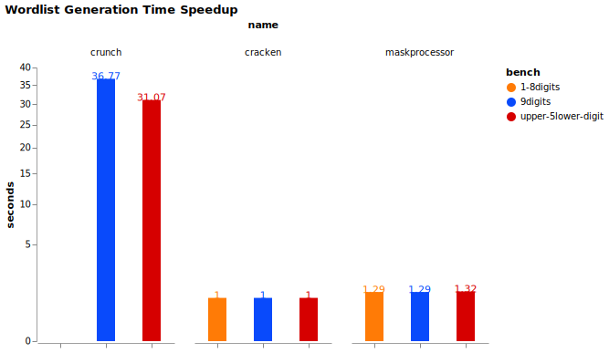

# Wordlist Mask Generators Benchmarks

## Results

As of writing this, Cracken is probably the world's fastest wordlist generator:



Cracken has 25% increased performance over hashcat's fast [maskprocessor][mp] (written in C).

Cracken can generate around 2 GiB/s per core.

**Benchmark System Info:**

* Ubuntu 20.04 5.11.0-38-generic x86_64 Intel(R) Core(TM) i7-9850H CPU @ 2.60GHz
* gcc 9.3.0
* rustc 1.56.1
* cracken v0.1.8
* maskprocessor 0.73
* crunch 3.6

## Why Cracken is Fast?

Cracken uses multiple small optimizations but the most noticeable one is something i call a jump table.

A jump table is an array of 256 chars that maps each char to the next on the charset saving some memory access and a branch or two for every password generated.

jump table array for lower alpha looks like this:

| idx | val |
| --- | --- |
| 0x0 | 0   |
| 0x1 | 0   |
| ... | ... |
| 'a' | 'b' |
| 'b' | 'c' |
| ... | ... |
| 'y' | 'z' |
| 'z' | 'a' |
| ... | ... |
| 0xff|  0  |

whenever `next_char <= char` we reached the last char on the charset.

for more details see `src/generators.rs:CharsetGenerator` on the source.

## Why Cracken is Fast (Hybrid Masks)?

Cracken can generate combinations of any wordlist charset and static chars (e.g. `?w1?w2?d?w1?l?u hello ?w3`).

To make it fast Cracken does:

* load wordlists into memory
* sort wordlists by size and store them as big a buffer - `Vec<u8>` instead of `Vec<Vec<u8>>`.
  it is done to save memory (and thus cpu cache) and avoid another pointer indirection.
* iterate wordlists by length - when same length no suffix copy needs to be done

for more details see `src/generators.rs:WordlistGenerator` on the source.


## Other Generic Optimizations

* fill the output buffer with `'\n'` chars once at start to save some mem writes
* pre-compute wordlist batch size, simplify main loop if statement
* use of stack pre-allocated buffers on main loop (no dynamic allocations on main loop)
* tuning output buffer size

hope this info will help future implementations of wordlist generators.


## Running Benchmarks

### 1. build from source

first build these from source:
 
* cracken
* [maskprocessor][mp]
* [crunch][crunch]


### 2. run benchmarks

run the benchmarks script:

```bash
$ python run_bench.py
```

this will generate `results.json` file


### 3. plot the benchmarks

run [create-bench-graphs.ipynb][notebook] jupyter notebook

[mp]: https://github.com/hashcat/maskprocessor
[crunch]: https://github.com/crunchsec/crunch
[notebook]: ./create-bench-graphs.ipynb
