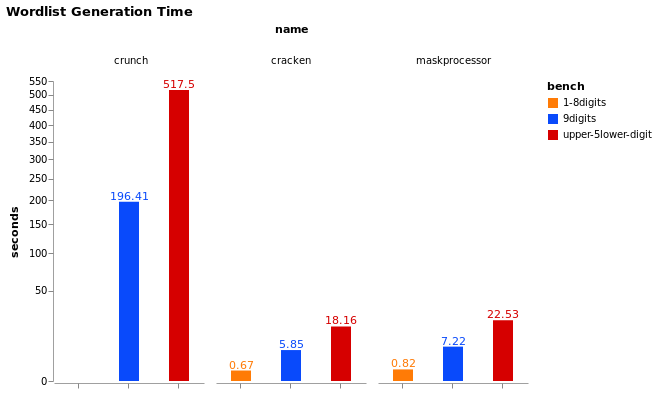

# Wordlist Mask Generators Benchmarks

## Results

As of writing this, Cracken is probably the world's fastest wordlist generator:



Cracken has 20% increased performance over hashcat's fast [maskprocessor][mp] (written in C).

Cracken can generate around 1.5 GiB/s per core.

**Benchmark System Info:**

* Ubuntu 18.04 4.15.0-48-generic x86_64 Intel(R) Core(TM) i7-7600U CPU @ 2.80GHz
* gcc 7.4.0
* rustc 1.35.0
* cracken v0.1.0
* maskprocessor 0.73
* crunch 3.6

## Why Cracken is Fast?

Cracken uses multiple small optimizations but the most noticeable one is something i call jump table.

A jump table is an array of 256 chars that maps each char to the next on the charset saving some memory access and a branch or two for every password generated.

jump table array for lower alpha looks like this:

| idx | val |
| --- | --- |
| 0x0 | 0   |
| 0x1 | 0   |
| ... | ... |
| 'a' | 'b' |
| 'b' | 'c' |
| ... | ... |
| 'y' | 'z' |
| 'z' | 'a' |
| ... | ... |
| 0xff|  0  |

whenever `next_char <= char` we reached the last char on the charset.

for more details see `impl WordGenerator` on the source.

**other optimizations:**

* fill the output buffer with `'\n'` chars to save some mem writes
* pre-compute wordlist batch size, simplify main loop if statement
* use of stack allocated buffers on main workloads
* build on compile time the jump tables for common charsets: digits, lowercase, uppercase...
* tuning output buffer size

hope this info will help future implementations of wordlist generators.


## Running Benchmarks

### 1. build from source

first build these from source:
 
* cracken
* [maskprocessor][mp]
* [crunch][crunch]


### 2. run benchmarks

run the benchmarks script:

```bash
$ python run_bench.py
```

this will generate `results.json` file


### 3. plot the benchmarks

run [create-bench-graphs.ipynb][notebook] jupyter notebook

[mp]: https://github.com/hashcat/maskprocessor
[crunch]: https://github.com/crunchsec/crunch
[notebook]: ./create-bench-graphs.ipynb
