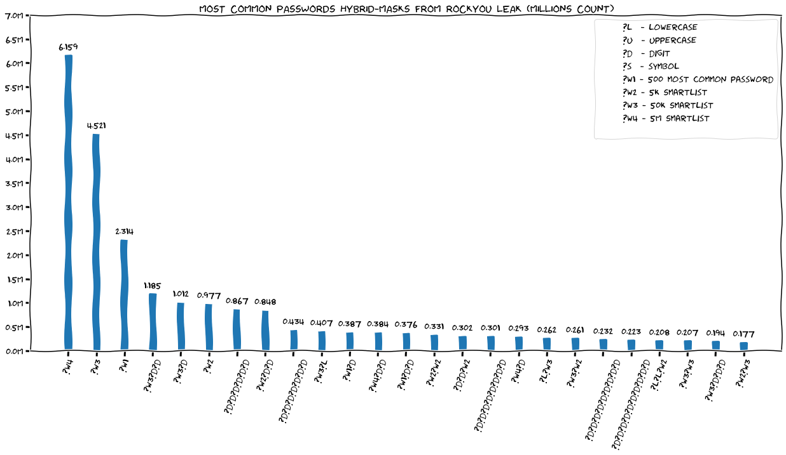

# Releasing the Cracken - a Data Driven Approach for Password generation (DeepSec21)

This dir contains the talk slides and the demo presented at [DeepSec2021][talk-abstract]

## Demo

[][demo-link]

<i>**Watch on [asciinema.org][demo-link]**</i>

## Hybrid Mask Analysis of RockYou Leak Passwords

We've used 4 wordlists to analyze the minimal size of passwords from RockYou leak (full hybrid masks list on [here](./rockyou_hybrid-masks_counts.csv)).

[talk-abstract]: https://deepsec.net/speaker.html#PSLOT517
[demo-link]: https://asciinema.org/a/W8tIemGMzAEuNBvHbii7rcIds
